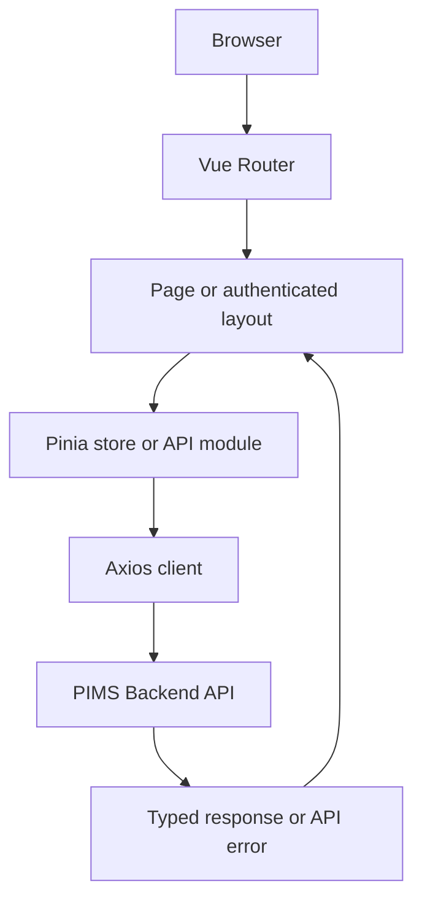

# PIMS Frontend Application Flow

## 1. Overview

PIMS Frontend is a single-page application built with Vue 3 and TypeScript. It
uses Element Plus for the interface, Vue Router for navigation, Pinia for the
authentication state, and Axios for communication with the backend REST API.

The frontend does not access the database or filesystem directly. The backend
remains responsible for authentication, ownership, validation, persistence,
and all authoritative business rules.

## 2. Application Flow



1. Vue Router resolves a guest or authenticated route.
2. Authenticated pages render inside the responsive application layout.
3. A page validates user input and calls a feature API module.
4. The shared Axios client adds common headers and the access token.
5. Typed API data updates the page state. Standard API errors are translated
   into field errors or Element Plus messages.

## 3. Authentication and Session Flow

### Register and Login

1. The register page validates the name, email, password strength, and matching
   confirmation password.
2. Registration calls the backend and then automatically logs in with the new
   credentials.
3. Login stores the access token and user profile in `sessionStorage` and Pinia.
4. The backend refresh token is never read by JavaScript; the browser stores it
   as an HttpOnly cookie because Axios uses `withCredentials: true`.
5. The user is redirected to the originally requested protected route or the
   inventory list.

### Route Protection

- Routes under the authenticated layout use `requiresAuth`.
- Login and register use `guestOnly`.
- The global navigation guard checks the locally stored access token.
- Client-side guards improve navigation behavior but are not a security
  boundary. Every protected backend request still requires a valid JWT.

### Automatic Token Refresh

1. The request interceptor adds `Authorization: Bearer <access-token>` when a
   token is available.
2. If a protected request returns `401`, the response interceptor performs one
   refresh attempt using a separate Axios client.
3. A successful refresh replaces the access token and retries the original
   request once.
4. A failed refresh clears the local session and redirects to `/login`.
5. Logout calls the backend to revoke the refresh token and always clears the
   frontend session.

## 4. Shared API Conventions

Every API request automatically includes:

- `X-CHANNEL-ID: WEB`
- `X-SERVICE-ID: pims-fe`
- A generated `X-REQUEST-ID`
- The bearer token when authenticated

Feature API modules isolate endpoint details for authentication, categories,
locations, inventory, reference data, and images. TypeScript interfaces model
requests, responses, pagination, and domain values.

The shared error utility converts backend error codes into readable messages.
Pages use those messages for form fields, notifications, loading failures, and
partial image-upload failures.

## 5. Feature Flows

### Categories and Locations

- Paginated lists are loaded from their feature APIs.
- Create and update forms use Element Plus dialogs and client-side rules.
- Backend validation errors are mapped back to individual fields.
- Delete actions require confirmation and reload the active page.

### Inventory List

1. The page loads inventory data and category/location references.
2. Users can search and filter by category, location, condition, and status.
3. Sort and pagination selections are sent to the backend rather than applied
   only to the visible page.
4. View, edit, create, and delete actions navigate to or update the relevant
   inventory flow.

### Inventory Create and Update

1. The form loads category and location options. Edit mode also loads the item
   and its current image count.
2. Element Plus rules validate required fields, lengths, numeric ranges, and
   dates.
3. Selected source images must be JPEG or PNG, at most 5 MB each, and must not
   make the item exceed five total images.
4. Before the inventory request is submitted, each selected image is converted
   through browser Canvas to WebP. Quality and dimensions are reduced until the
   output is 100,000 bytes or smaller.
5. The item is created or updated, then compressed images are uploaded one at a
   time through the existing single-file endpoint.
6. If an image fails after the item is saved, the user receives a partial-upload
   warning and is redirected to the detail page.

### Inventory Detail and Images

1. Item details and display names for category/location are loaded.
2. Image metadata is fetched first. Each protected binary image is then fetched
   as a Blob and converted to a temporary object URL for Element Plus preview.
3. Object URLs are revoked when images are reloaded or the page is unmounted.
4. The gallery shows the primary image, file information, preview, and delete
   actions.
5. The add-image action is hidden when the item already has five images.

## 6. Project Structure

```text
src/
├── api/          Shared Axios client and feature endpoint modules
├── constants/    Shared frontend limits and values
├── layouts/      Authenticated responsive application shell
├── router/       Routes and navigation guards
├── stores/       Pinia authentication state
├── styles/       Layout, shared-page, and feature-specific styles
├── types/        API and domain TypeScript types
├── utils/        Session, formatting, errors, and image compression
└── views/        Authentication and feature pages
```

## 7. Source Documentation

- [Backend API contracts](https://github.com/Yosmerry/pims-be/tree/release/1.0.0-RELEASE/docs/api)
- [Backend application flow](https://github.com/Yosmerry/pims-be/blob/release/1.0.0-RELEASE/docs/foundation/summary.md)
- [Entity relationship diagram](https://github.com/Yosmerry/pims-be/blob/release/1.0.0-RELEASE/docs/foundation/pims-erd.jpg)

The limitations and production-readiness disclaimer are documented in the root
[README](../../README.md).
